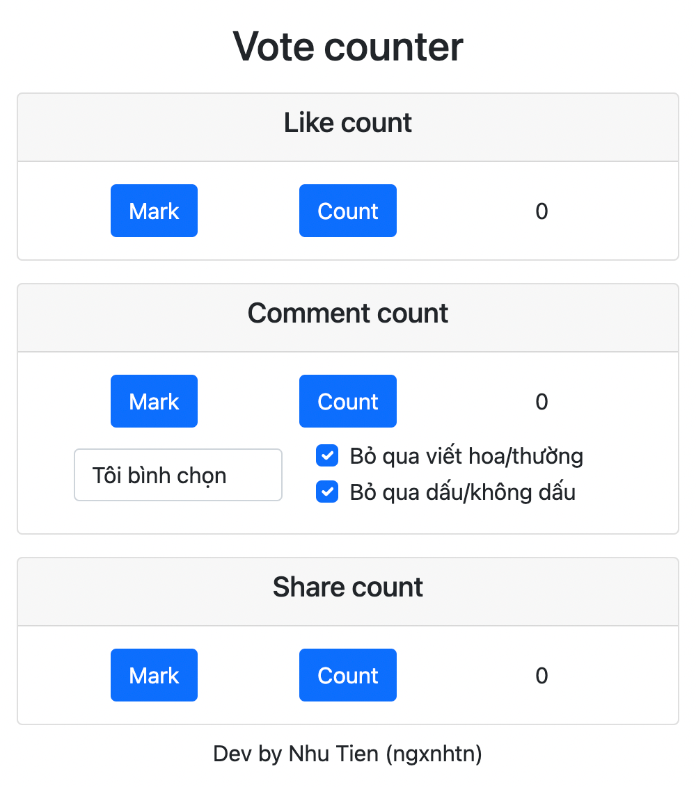

# Vote counter for Ban Van hoa - The thao

This tool was made in order to assist the Ban Van hoa - The thao in counting votes on Facebook. It could mark, classify and count votes for each candidates. Main method using here is reading data directly from DOM and then inject into the DOM some useful analytics.

## Some images

- Main interface:

- Like count:

- Comment count:

- Share count:

